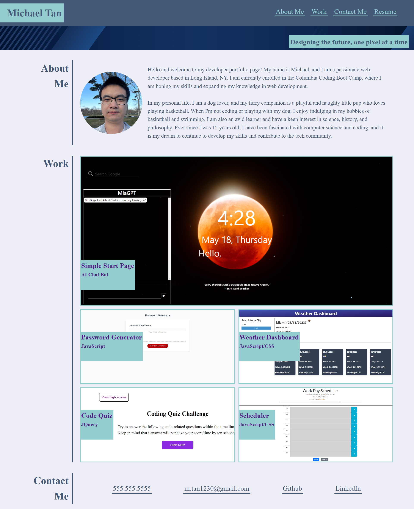

# Basic Portfolio

## Description
This is the first iteration of my portfolio website, used only basic HTML and CSS. It's including my biographical information, projects, and contact information.

## Links
Page published at https://mtan1230.github.io/first-iteration-portfolio/

## Screenshot

## Credits
Pattern designed and provided by Columbia Coding Bootcamp.
Banner image provided by Sketchepedia on Freepik